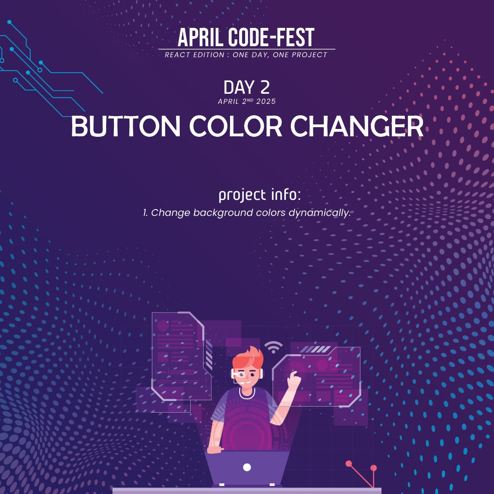
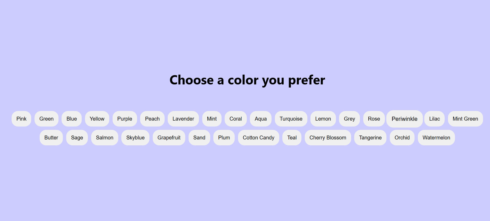

# 🎨 React Button Color Changer App

An engaging and colorful React application that lets users change the background color by clicking on a button. Great for beginners exploring `useState` and styling with CSS. 🌈🖱️

---

## 🎯 Features
- 🎨 Clickable buttons to change background colors
- 🚀 Responsive UI with a soothing pastel palette
- 💡 Clean, simple interface — perfect for practicing React state management

---

## 🛠️ Technologies Used
- ⚛️ **React** (`useState` Hook for managing state)
- 💻 **JavaScript** (Modern ES6+ syntax)
- 🎨 **CSS** (Custom styles for button layout and container)
- 📄 **HTML** (Component rendering structure via JSX)

---

## 🚀 Live Demo

1. **Clone the repository:**
   git clone https://github.com/your-username/react-counter-app.git

2. Navigate to the project directory:    
   cd react-counter-app

3. Install dependencies:
   npm install

4. Start the development server:
   npm start

5. Open your browser and visit:
   http://localhost:3000

---

## 🎨 Screenshots

---

## 🤝 Contributing
Excited to improve this project? Fork the repository, create a feature branch, and open a pull request. Every contribution helps make it better! 🚀✨

Happy coding!